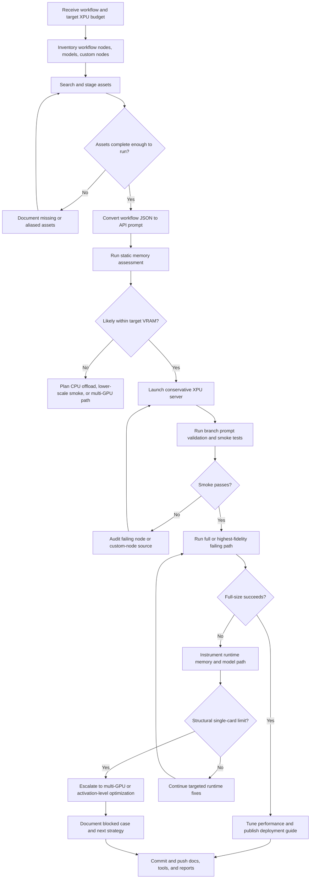

# Intel XPU workflow migration docs guide

This folder collects the reusable docs, workflow-specific reports, and handoff material created during the Intel XPU migration work.

Use it in two layers:

1. **Reusable method docs** for the next workflow
2. **Workflow-specific case docs** for the Dasiwa WAN2.2 migration

## Who should read what

| If you want to... | Read this first | Then read |
| --- | --- | --- |
| start a new migration | `intel-xpu-workflow-migration-prompt.md` | `intel-xpu-workflow-migration-skill.md`, `intel-xpu-workflow-asset-prep.md` |
| prepare a publishable migration package | `intel-xpu-workflow-release-standard.md` | `intel-xpu-workflow-migration-skill.md`, `intel-xpu-workflow-asset-prep.md` |
| tune an already-running workflow | `intel-xpu-workflow-tuning-prompt.md` | `intel-xpu-workflow-tuning-skill.md`, `intel-xpu-workflow-performance-tuning.md` |
| reproduce the older Dasiwa workflow result | `intel-xpu-workflow-full-repro-guide.md` | `intel-xpu-workflow-deployment.md` |
| understand the new Dasiwa WAN2.2 migration | `../workflow_analyse.md` | `dasiwa-b60-migration-plan.md`, `dasiwa-b60-xpu-support-matrix.md` |
| understand why full-size `54` still fails | `dasiwa-b60-fullsize-oom-report.md` | `../memory_checklist.md` |
| prepare models and custom nodes | `intel-xpu-workflow-asset-prep.md` | `../script_examples/dasiwa_b60_prepare_assets.sh` |
| review the newer B70-named workflow case package | `artifacts/b70/workflow 分析.md` | `artifacts/b70/显存分析.md`, `artifacts/b70/完整测试报告.md` |
| review the original Dasiwa workflow remote package | `artifacts/original-remote/README.md` | `artifacts/original-remote/logs/`, `artifacts/original-remote/prompts/` |

## Recommended business flow

## Practical execution order

### 1. Start with method docs

For a new workflow:

- `intel-xpu-workflow-migration-prompt.md`
- `intel-xpu-workflow-migration-skill.md`
- `intel-xpu-workflow-asset-prep.md`

For tuning:

- `intel-xpu-workflow-tuning-prompt.md`
- `intel-xpu-workflow-tuning-skill.md`

### 2. Use the workflow-specific docs as examples

The Dasiwa WAN2.2 B60 case shows what “real migration evidence” should look like:

- `../workflow_analyse.md`: topology, dependencies, current validated state
- `dasiwa-b60-migration-plan.md`: executed outcome, successful cases, blocked cases
- `dasiwa-b60-xpu-support-matrix.md`: current support posture by node family
- `dasiwa-b60-fullsize-oom-report.md`: root-cause writeup for the blocked full-size branch
- `dasiwa-b60-e2e-test-plan.md`: coverage plan for branch/scenario testing

## How the docs fit together

### Reusable migration docs

| File | Purpose |
| --- | --- |
| `intel-xpu-workflow-migration-prompt.md` | standard task prompt for the next migration engagement |
| `intel-xpu-workflow-migration-skill.md` | reusable migration method and evidence standard |
| `intel-xpu-workflow-asset-prep.md` | repeatable asset search, staging, and source-tracking flow |
| `intel-xpu-workflow-release-standard.md` | standard release/package structure for code patches, tests, deployment, assets, and publication |
| `intel-xpu-workflow-deployment.md` | deployment and runtime conventions for the older successful workflow |
| `intel-xpu-workflow-full-repro-guide.md` | step-by-step reproduction guide for the older workflow |

### Reusable tuning docs

| File | Purpose |
| --- | --- |
| `intel-xpu-workflow-tuning-prompt.md` | standard request template for XPU tuning work |
| `intel-xpu-workflow-tuning-skill.md` | reusable tuning algorithm and reporting standard |
| `intel-xpu-workflow-performance-tuning.md` | benchmark-driven example of how a tuning engagement should be written up |

### Workflow-specific Dasiwa WAN2.2 docs

| File | Purpose |
| --- | --- |
| `../workflow_analyse.md` | workflow-level analysis, resolved assets, remaining gaps |
| `dasiwa-b60-migration-plan.md` | migration outcome, completed work, remaining escalation path |
| `dasiwa-b60-xpu-support-matrix.md` | node-family support posture on B60/XPU |
| `dasiwa-b60-e2e-test-plan.md` | branch/scenario validation plan |
| `dasiwa-b60-fullsize-oom-report.md` | full-size `54` OOM root cause and memory analysis |

## Asset policy to keep consistent

The migration now uses three asset labels. Keep them explicit in docs and handoffs:

| Asset state | Meaning |
| --- | --- |
| **resolved and staged** | source found and staged into `models/` |
| **smoke-only compatibility alias** | allows prompt validation or smoke execution while preserving original workflow JSON |
| **unresolved proprietary source** | original requested filename/source still not recovered |

Do **not** describe a smoke-only alias as if it proved source-identical fidelity.

## Success and failure vocabulary

Use these terms consistently:

| Term | Meaning |
| --- | --- |
| **prompt validation success** | workflow/API prompt loads and validates |
| **smoke success** | reduced-resource or compatibility run completes |
| **full-size success** | target fidelity and scale complete under the intended budget |
| **blocked case** | known failure with identified root cause and next escalation path |

## When to stop tuning and escalate

If both are true:

1. runtime logs show `free + required > total_vram`
2. theoretical active weights + activation peak also exceed the budget

then treat it as a **capacity limit**, not a generic tuning issue.

Escalate to:

- multi-GPU
- activation-level model/runtime optimization
- smaller-generation-plus-postprocess deployment tier

## Related top-level files

These live outside `docs/` but are part of the same migration package:

- `../workflow_analyse.md`
- `../memory_checklist.md`
- `../migration_checklist.md`
- `../script_examples/dasiwa_b60_prepare_assets.sh`
- `../script_examples/dasiwa_b60_stage_smoke_assets.sh`
- `../script_examples/dasiwa_b60_search_models.sh`
- `../script_examples/dasiwa_b70_prepare_assets.sh`
- `../script_examples/dasiwa_b70_stage_smoke_assets.sh`
- `../script_examples/dasiwa_b70_search_models.sh`
- `../script_examples/workflow_branch_runner.py`
- `../script_examples/workflow_memory_assessor.py`
- `../script_examples/xpu_memory_dashboard.py`

## Recommended handoff package

For a future workflow migration, hand off these together:

1. this `README.md`
2. the migration prompt + skill
3. the asset-prep guide
4. the release standard
5. the memory and migration checklists
6. the workflow-specific analysis, support matrix, and blocked-case report

That gives the next engineer both the **method** and the **case evidence**.
