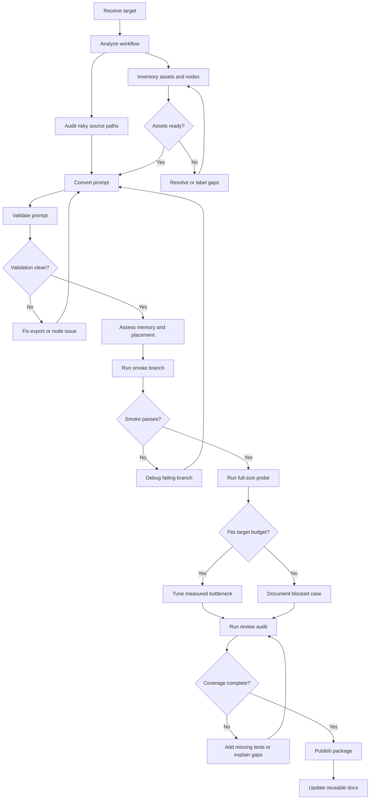

# Intel XPU workflow migration docs guide

This folder collects the reusable docs, workflow-specific reports, and handoff material created during the Intel XPU migration work.

Use it in two layers:

1. **Reusable method docs** for the next workflow
2. **Workflow-specific case docs** for the Dasiwa WAN2.2 migration

## Who should read what

| If you want to... | Read this first | Then read |
| --- | --- | --- |
| start a new migration | `intel-xpu-workflow-migration-prompt.md` | `intel-xpu-workflow-migration-skill.md`, `intel-xpu-workflow-asset-prep.md` |
| prepare a publishable migration package | `intel-xpu-workflow-release-standard.md` | `intel-xpu-workflow-migration-skill.md`, `intel-xpu-workflow-asset-prep.md` |
| tune an already-running workflow | `intel-xpu-workflow-tuning-prompt.md` | `intel-xpu-workflow-tuning-skill.md`, `intel-xpu-workflow-performance-tuning.md` |
| review whether every workflow node was really migrated and tested | `intel-xpu-workflow-review-prompt.md` | the workflow JSON, authoritative full prompt, full-run artifacts, and successful branch-smoke artifacts |
| reproduce the older Dasiwa workflow result | `intel-xpu-workflow-full-repro-guide.md` | `intel-xpu-workflow-deployment.md` |
| understand the new Dasiwa WAN2.2 migration | `workflow_analyse.md` | `dasiwa-b60-migration-plan.md`, `dasiwa-b60-xpu-support-matrix.md` |
| understand why full-size `54` still fails | `dasiwa-b60-fullsize-oom-report.md` | `memory_checklist.md` |
| prepare models and custom nodes | `intel-xpu-workflow-asset-prep.md` | `../script_examples/dasiwa_b60_prepare_assets.sh` |
| review the newer B70-named workflow case package | `artifacts/b70/workflow 分析.md` | `artifacts/b70/显存分析.md`, `artifacts/b70/完整测试报告.md` |
| review the original Dasiwa workflow remote package | `artifacts/original-remote/README.md` | `artifacts/original-remote/性能调优报告.md`, `artifacts/original-remote/perf/` |

## Recommended business flow

If the Mermaid renderer still truncates labels in your viewer, use this text version:

1. receive workflow + target budget
2. analyze the workflow structure before touching runtime
3. inventory nodes, models, custom nodes, and risky source paths
4. resolve or explicitly label asset gaps
5. convert workflow JSON to API prompt and validate the prompt itself
6. assess memory and choose placement before expensive runs
7. run smoke branches first, then the full-size or highest-fidelity probe
8. tune only from measured bottlenecks, or document a real capacity limit
9. run a review audit to prove executable-node coverage
10. publish patches, docs, reports, and reusable process updates

## Practical execution order

### 1. Start with method docs

For a new workflow:

- `intel-xpu-workflow-migration-prompt.md`
- `intel-xpu-workflow-migration-skill.md`
- `intel-xpu-workflow-asset-prep.md`
- create or refresh `workflow_analyse.md` before runtime work

For tuning:

- `intel-xpu-workflow-tuning-prompt.md`
- `intel-xpu-workflow-tuning-skill.md`

For post-migration review:

- `intel-xpu-workflow-review-prompt.md`

### 2. Use the workflow-specific docs as examples

The Dasiwa WAN2.2 B60 case shows what “real migration evidence” should look like:

- `workflow_analyse.md`: topology, dependencies, current validated state
- `dasiwa-b60-migration-plan.md`: executed outcome, successful cases, blocked cases
- `dasiwa-b60-xpu-support-matrix.md`: current support posture by node family
- `dasiwa-b60-fullsize-oom-report.md`: root-cause writeup for the blocked full-size branch
- `dasiwa-b60-e2e-test-plan.md`: coverage plan for branch/scenario testing

## How the docs fit together

### Reusable migration docs

| File | Purpose |
| --- | --- |
| `intel-xpu-workflow-migration-prompt.md` | standard task prompt for the next migration engagement |
| `intel-xpu-workflow-review-prompt.md` | standard task prompt for auditing whether all executable workflow nodes were really migrated and tested |
| `intel-xpu-workflow-migration-skill.md` | reusable migration method and evidence standard |
| `intel-xpu-workflow-asset-prep.md` | repeatable asset search, staging, and source-tracking flow |
| `intel-xpu-workflow-release-standard.md` | standard release/package structure for code patches, tests, deployment, assets, and publication |
| `intel-xpu-workflow-deployment.md` | deployment and runtime conventions for the older successful workflow |
| `intel-xpu-workflow-full-repro-guide.md` | step-by-step reproduction guide for the older workflow |

### Reusable tuning docs

| File | Purpose |
| --- | --- |
| `intel-xpu-workflow-tuning-prompt.md` | standard request template for XPU tuning work |
| `intel-xpu-workflow-tuning-skill.md` | reusable tuning algorithm and reporting standard |
| `intel-xpu-workflow-performance-tuning.md` | benchmark-driven example of how a tuning engagement should be written up |

### Workflow-specific Dasiwa WAN2.2 docs

| File | Purpose |
| --- | --- |
| `workflow_analyse.md` | workflow-level analysis, resolved assets, remaining gaps |
| `dasiwa-b60-migration-plan.md` | migration outcome, completed work, remaining escalation path |
| `dasiwa-b60-xpu-support-matrix.md` | node-family support posture on B60/XPU |
| `dasiwa-b60-e2e-test-plan.md` | branch/scenario validation plan |
| `dasiwa-b60-fullsize-oom-report.md` | full-size `54` OOM root cause and memory analysis |
| `memory_checklist.md` | reusable memory triage and capacity-decision checklist |
| `migration_checklist.md` | reusable migration and platform-selection checklist |

## Asset policy to keep consistent

The migration now uses three asset labels. Keep them explicit in docs and handoffs:

| Asset state | Meaning |
| --- | --- |
| **resolved and staged** | source found and staged into `models/` |
| **smoke-only compatibility alias** | allows prompt validation or smoke execution while preserving original workflow JSON |
| **unresolved proprietary source** | original requested filename/source still not recovered |

Do **not** describe a smoke-only alias as if it proved source-identical fidelity.

## Success and failure vocabulary

Use these terms consistently:

| Term | Meaning |
| --- | --- |
| **prompt validation success** | workflow/API prompt loads and validates |
| **smoke success** | reduced-resource or compatibility run completes |
| **full-size success** | target fidelity and scale complete under the intended budget |
| **blocked case** | known failure with identified root cause and next escalation path |

## How to use the review prompt

Use `intel-xpu-workflow-review-prompt.md` after a migration, smoke run, or tuning pass when you need to answer the stricter question: **did we actually cover every executable node, or did we only prove a subset of branches?**

The prompt is designed to force a four-way comparison:

1. workflow JSON node set
2. authoritative converted full prompt
3. full-run execution evidence
4. successful branch-smoke evidence

That keeps the review honest:

- structural nodes such as `Reroute` and `Note` are counted but excluded from runtime-gap claims
- prompt nodes missing from the full run must either be explained by successful branch-smoke evidence or reported as uncovered
- the final conclusion can say “all executable nodes were covered across full plus smoke evidence” without falsely claiming “every node ran in one full execution”

## Process reflection: a more scientific default flow

The current migration and review work showed that the old “make it run, then tune it, then document it” habit is too weak for large workflows. A better default is an **evidence-gated loop** with explicit checkpoints.

1. **Workflow analysis first**
   - count nodes, outputs, branch families, models, and custom nodes before changing runtime behavior
   - separate structural UI helpers from executable runtime nodes up front
2. **Prompt validation before runtime interpretation**
   - confirm the converted prompt is complete before trusting any run result
   - inspect `node_errors` and validated outputs before calling a branch successful
3. **Smoke before full-size**
   - prove branch reachability cheaply
   - keep smoke-success separate from full-fidelity or source-identical claims
4. **Measurement before tuning**
   - let timing, memory, and logs decide whether the next step is tuning, compatibility work, or a capacity-limit conclusion
5. **Review audit before publish**
   - compare workflow JSON, full prompt, full-run execution, and successful branch-smoke evidence
   - do not publish “fully migrated” unless every executable node is accounted for
6. **Method update as part of the deliverable**
   - prompt, skill, checklist, README, and release docs should be updated from the actual lessons learned

This reduces two common failure modes:

- claiming migration success when only part of the workflow was really executed
- spending time “tuning” a path that is actually blocked by exporter gaps, missing assets, or a structural memory limit

## When to stop tuning and escalate

If both are true:

1. runtime logs show `free + required > total_vram`
2. theoretical active weights + activation peak also exceed the budget

then treat it as a **capacity limit**, not a generic tuning issue.

Escalate to:

- multi-GPU
- activation-level model/runtime optimization
- smaller-generation-plus-postprocess deployment tier

## Related files

These are important companion files in or alongside `docs/`:

- `workflow_analyse.md`
- `memory_checklist.md`
- `migration_checklist.md`
- `../script_examples/dasiwa_b60_prepare_assets.sh`
- `../script_examples/dasiwa_b60_stage_smoke_assets.sh`
- `../script_examples/dasiwa_b60_search_models.sh`
- `../script_examples/dasiwa_b70_prepare_assets.sh`
- `../script_examples/dasiwa_b70_stage_smoke_assets.sh`
- `../script_examples/dasiwa_b70_search_models.sh`
- `../script_examples/workflow_branch_runner.py`
- `../script_examples/workflow_memory_assessor.py`
- `../script_examples/xpu_memory_dashboard.py`

## Recommended handoff package

For a future workflow migration, hand off these together:

1. this `README.md`
2. the migration prompt + skill
3. the review prompt when node-coverage audit is required
4. the asset-prep guide
5. the release standard
6. the memory and migration checklists under `docs/`
7. the workflow-specific analysis, support matrix, and blocked-case report

That gives the next engineer both the **method** and the **case evidence**.
