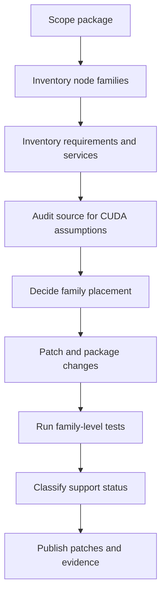

# Intel XPU custom-node migration checklist

Use this document when migrating a **custom-node repository or node package** to Intel XPU.

This is not a workflow checklist. The unit of migration here is the package itself: its Python modules, optional extensions, dependencies, service assumptions, node families, and test evidence.

## Goal

Produce a package-level migration result that answers all of these clearly:

1. Which node families in the package were reviewed?
2. Which families run on XPU as-is or with patches?
3. Which families should stay on CPU?
4. Which families should be optional-disabled on Intel?
5. Which families are still blocked and why?
6. What source evidence, test evidence, and patch artifacts justify those claims?

## Non-negotiable rules

1. Audit the package by **node family**, not by one lucky demo node.
2. Treat README claims and upstream issue comments as hypotheses until source or runtime evidence confirms them.
3. Keep **XPU support**, **CPU fallback support**, **optional-disabled**, and **blocked** as separate statuses.
4. Do not call a package “ported” if only one branch, one loader, or one helper node was exercised.
5. Do not hide Intel gaps by silently deleting imports, skipping registration, or bypassing failing features without documenting the resulting package surface.
6. Keep smoke success, family-level success, and full-package readiness as separate labels.

## Recommended migration flow



If your Markdown viewer does not render Mermaid cleanly, use this text version:

1. scope the package boundary first
2. inventory all exported node families
3. inventory Python/native requirements and external services
4. audit source for CUDA-only assumptions
5. decide XPU vs CPU fallback vs optional-disabled vs blocked for each family
6. implement and isolate patches
7. run family-level tests and collect runtime evidence
8. publish the support matrix, patch bundle, and limitations without overclaiming

## 1. Scope the package before editing code

Record the exact migration target:

- repository URL and commit or tag
- package directory inside `custom_nodes/`
- nested git repos or vendored submodules
- Python package entrypoints and registration files
- whether the package ships only ComfyUI nodes or also helper CLIs / servers / web assets
- target Intel platform assumptions:
  - XPU generation
  - expected PyTorch build
  - expected IPEX / oneAPI / driver baseline
  - expected ComfyUI baseline

### Scope checklist

```text
□ upstream repo and revision are frozen
□ package root and nested repos are identified
□ node registration files are identified
□ optional extras / native extensions are identified
□ target Intel runtime baseline is written down
□ out-of-scope features are stated before patching
```

## 2. Inventory node families, not just node classes

Build a node-family inventory first. Families are usually better migration units than individual classes because they share loaders, kernels, utilities, or service clients.

For each family, capture:

- family name
- exported node classes
- main source files
- shared helper modules
- models, checkpoints, tokenizers, or assets used by the family
- whether the family is compute-heavy, I/O-heavy, service-backed, or mostly utility logic
- whether the family mutates device placement itself or depends on ComfyUI/core loaders

Suggested status labels:

| Status | Meaning |
| --- | --- |
| `xpu-ready` | family runs on Intel XPU with current package patches |
| `cpu-fallback` | family is functional only when key execution stays on CPU |
| `optional-disabled` | family is intentionally not loaded or advertised on Intel builds |
| `blocked` | family cannot yet be supported with the current constraints |
| `audit-needed` | family inventory exists but source/runtime evidence is still incomplete |

### Family inventory checklist

```text
□ every exported node class is mapped to a family
□ helper-only modules are separated from runtime node families
□ model / tokenizer / asset dependencies are listed per family
□ family-level status starts as audit-needed until evidence exists
```

## 3. Inventory requirements, extensions, and external services

Do not start patching `torch.cuda` calls before understanding the package surface area.

### 3.1 Python and native requirements

Inventory:

- `requirements.txt`, `pyproject.toml`, `setup.py`, `environment*.yml`
- optional extras and feature flags
- version pins for `torch`, `torchaudio`, `torchvision`, `xformers`, `triton`, `bitsandbytes`, `flash-attn`, `ninja`, `cupy`, `onnxruntime-gpu`
- native build paths such as `CUDAExtension`, `CppExtension`, `setuptools.setup(ext_modules=...)`, `load_inline`, or custom build scripts

### 3.2 External services and runtime assumptions

Inventory any node family that depends on more than local tensor execution:

- HTTP inference services
- OpenAI-compatible endpoints
- local model servers
- ffmpeg binaries
- system packages
- browser assets / JS front-end bundles
- database, cache, queue, or auth dependencies

A family that is device-clean in Python may still be blocked by a missing service contract or unsupported deployment dependency.

### Requirements checklist

```text
□ Python requirements are frozen
□ CUDA-only wheels or packages are identified
□ native extensions are classified as CPU-portable, XPU-portable, or CUDA-only
□ external services and binaries are listed per family
□ optional extras are separated from core package requirements
```

## 4. Audit source with repeatable CUDA-risk patterns

Search the entire package, then assign each hit to a node family.

### 4.1 Direct CUDA and device-string assumptions

Audit patterns such as:

- `torch.cuda.`
- `device="cuda"`
- `to("cuda")`, `.cuda()`
- `torch.autocast(device_type="cuda")`
- `torch.backends.cuda.*`
- `is_cuda`
- `cuda:` device parsing
- hardcoded `CUDA`, `gpu`, or NVIDIA-only environment branches

Typical migration actions:

- switch to device-agnostic code when possible
- use `torch.xpu.*` only where the API is truly XPU-specific
- route placement through one helper instead of scattered string literals
- keep CPU fallback explicit when XPU parity is not real

### 4.2 Bitsandbytes and quantization assumptions

Audit for:

- `bitsandbytes`
- 4-bit / 8-bit loaders tied to CUDA-only kernels
- `bnb.nn`, `bnb.optim`, or CUDA quantization helpers
- README instructions that require NVIDIA-specific wheels

Decision paths:

- replace with a device-neutral loader if one exists
- keep the family CPU-only if performance is acceptable and correctness matters more
- mark blocked if the core dependency is CUDA-only and no practical fallback exists

### 4.3 Custom CUDA kernels and compiled ops

Audit for:

- `.cu`, `.cuh`, `CUDAExtension`
- `torch.utils.cpp_extension.load`
- custom ops compiled only for CUDA
- Triton kernels with NVIDIA assumptions
- `cupy` or raw CUDA runtime calls

Decision paths:

- port to CPU / C++ fallback when feasible
- replace with upstream PyTorch ops when acceptable
- optional-disable the family if the kernel is an accelerator-only extra
- mark blocked if the node family is defined by a CUDA-only kernel and no fallback exists

### 4.4 Flash-attention, SDPA, and attention-backend assumptions

Audit for:

- `flash_attn`
- `scaled_dot_product_attention`
- `sdp_kernel`
- `enable_gqa=True`
- backend contexts tied to `torch.backends.cuda`
- assumptions that `is_causal` and `attn_mask` combinations behave like CUDA

Required caution:

- do not assume a CUDA attention fast path has an XPU equivalent
- verify both correctness and memory behavior
- if replacing with a slower safe path, document the family as CPU fallback or reduced-feature XPU support instead of “fully equivalent”

### 4.5 Device cleanup and memory APIs

Audit for:

- `torch.cuda.empty_cache()`
- `torch.cuda.mem_get_info()`
- `torch.cuda.synchronize()`
- direct allocator statistics or VRAM dashboards
- cleanup nodes that claim to free GPU memory

Required caution:

- verify whether the code actually needs a device-specific API or only needs a generic sync / cleanup contract
- if memory reporting changes semantics on XPU, document the new evidence source instead of pretending metrics are identical

### 4.6 Lazy imports vs eager imports

Audit for:

- top-level imports of CUDA-only packages
- unconditional extension loading during module import
- registration-time failures that prevent unrelated families from loading
- helper modules that import heavy model code before a node is used

Preferred outcome:

- keep unsupported extras behind lazy imports or feature guards
- allow supported families to register even if blocked families stay disabled
- document exactly which imports were deferred and why

### Source-audit checklist

```text
□ direct torch.cuda and hardcoded cuda strings are mapped to families
□ bitsandbytes usage is classified per family
□ custom CUDA kernels / Triton / cupy usage is classified per family
□ flash-attn / SDPA assumptions are reviewed
□ cleanup and memory APIs are reviewed
□ eager-import traps are converted to lazy or guarded imports where needed
□ every risky hit has a family-level disposition, not just a search result
```

## 5. Make family-level placement decisions explicitly

For each family, choose one primary deployment posture.

### 5.1 `xpu-ready`

Use this only when:

- core execution runs on Intel XPU
- required imports load on the target Intel stack
- output correctness is validated
- the family does not secretly depend on CPU-only fallback for its claimed main path

### 5.2 `cpu-fallback`

Use this when:

- the family is useful and correct on Intel systems
- the heavy or fragile step should stay on CPU
- XPU placement is slower, unstable, or unsupported
- a mixed XPU/CPU story is acceptable for the package

State exactly what stays on CPU:

- full family
- loader only
- attention only
- codec / I/O only
- postprocess only

### 5.3 `optional-disabled`

Use this when:

- the family is not required for the package's core value
- the family depends on CUDA-only extras or services that are not worth porting now
- the package can still load cleanly and honestly without it

Required behavior:

- disable it predictably
- expose a clear warning or docs note
- do not let import-time crashes remove unrelated supported families

### 5.4 `blocked`

Use this when:

- correctness or importability cannot be achieved under current constraints
- the family depends on a CUDA-only kernel or service with no acceptable substitute
- package support would be misleading without it

A blocked label is acceptable if the root cause and next escalation path are clear.

### Placement checklist

```text
□ every family has exactly one current status
□ CPU fallback scope is described precisely
□ optional-disabled families still allow package import/registration
□ blocked families have a concrete blocker and next-step note
□ package summary distinguishes partial support from full-package readiness
```

## 6. Test by family and collect evidence that survives review

Package migration is not done when the repo imports once.

### Minimum evidence types

Accept claims only when backed by one or more of:

1. source inspection
2. import / registration behavior
3. unit or script-level execution
4. ComfyUI node execution on Intel hardware
5. generated output files or service responses
6. benchmark or memory logs when placement/perf claims are made

### Required test layers

#### Layer 1: import and registration

Verify:

- the package imports on the target environment
- unsupported extras do not crash supported families
- all intended node classes register
- disabled families fail clearly and intentionally

#### Layer 2: family smoke tests

For each family status other than `optional-disabled`:

- run the smallest faithful invocation
- use stable inputs or fixtures
- confirm the real output object or file exists
- capture the exact node family exercised

#### Layer 3: fallback-path verification

For each `cpu-fallback` family:

- prove the fallback path really ran
- show which module or step stayed on CPU
- do not label it XPU-ready just because the package as a whole ran on an Intel system

#### Layer 4: blocked-case proof

For each `blocked` family:

- preserve the exact failing command or import
- preserve the stack trace or runtime error
- link the failure to the dependency or kernel limitation

### Evidence checklist

```text
□ import / registration evidence exists
□ each supported family has at least one smoke test
□ CPU fallback families have explicit fallback evidence
□ blocked families have preserved failure evidence
□ output files or returned tensors are checked for real success when applicable
□ performance or memory claims include measurement, not guesses
```

## 7. Package the patch set so another engineer can upstream it

A package-level migration should produce patch artifacts, not just a dirty tree.

Include:

- package patch file(s)
- separate patch files for nested repos when applicable
- a short patch index stating what each patch changes
- dependency changes and install notes
- Intel-specific feature flags or environment variables
- test commands used to validate each family status

Recommended structure:

```text
patches/
  <package-case>/
    README.md
    <package>.patch
    <nested-repo>.patch

docs/
  intel-xpu-node-migration-checklist.md
  <package-specific-report>.md   # when a case report is needed
```

Patch README should answer:

1. which upstream revision the patch applies to
2. which node families changed
3. which families are XPU-ready, CPU fallback, optional-disabled, or blocked
4. which dependencies were removed, replaced, or guarded
5. which tests justify the claims

## 8. Anti-overclaim rules

Use these rules in every summary, README, PR, and handoff.

### Never collapse these labels

Keep these separate:

- import success
- package registration success
- family smoke success
- package partial support
- package broad support
- blocked family with documented workaround

### Avoid these bad claims

Do not say:

- “the custom node is fully migrated” when only one family ran
- “Intel XPU supported” when execution actually used CPU fallback for the main compute path
- “works on Intel” when the package imports but key families are disabled
- “performance improved” without benchmark output
- “memory issue solved” without runtime evidence

### Prefer wording like this

- “package imports on Intel; 3 of 5 node families are XPU-ready, 1 is CPU fallback, 1 is blocked”
- “attention family runs only with safe SDPA fallback; flash-attn path remains unsupported”
- “quantized loader family remains blocked by bitsandbytes CUDA dependency”
- “cleanup helper was patched for XPU-safe behavior, but memory metrics are not claimed equivalent to CUDA”

## 9. Final deliverables

A reusable package migration handoff should include:

1. family inventory and support matrix
2. requirements / services inventory
3. source-audit summary with CUDA-risk findings
4. package patch bundle
5. test commands and preserved evidence
6. plain-language limitation summary

## 10. Acceptance checklist

The migration is not complete unless all of these are true:

```text
□ package scope and upstream revision are frozen
□ all exported nodes are grouped into families
□ requirements, native extensions, and external services are inventoried
□ CUDA-risk source patterns were audited and classified
□ every family has one explicit status
□ supported families have smoke evidence
□ CPU fallback families have fallback evidence
□ blocked or disabled families are documented honestly
□ patch artifacts are generated for the package and nested repos
□ final summary does not overclaim package-wide XPU support
```
